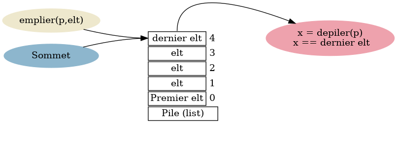

# Structures de données en python

**Introduction aux Types de Données en Python**

Les types de données jouent un rôle essentiel dans la programmation en Python, déterminant comment les informations sont stockées, manipulées et interprétées par un programme.

Ce graphe explore les différents types de données disponibles en Python, classés en deux grandes catégories : les _types prédéfinis_ intégrés au language et les _types utilisateur_ que vous pouvez créer.
Chaque catégorie comprend une variété de types, notamment des types modifiables et non modifiables, des types simples et des conteneurs.

Comprendre ces types est fondamental pour devenir un développeur Python compétent.

<i>This graph is created 
by <a href="https://www.linkedin.com/in/anis-saied">@anis-saied</a> with &hearts; 
using : <a href="https://www.graphviz.org/">DOT</a> 
and <a href="https://github.com/pydot/pydot">Python pydot</a></i>

**Description du Graphe des Types de Données**

Le graphe ci-dessus présente une classification visuelle des types de données en Python. Il est conçu pour vous aider à comprendre la structure des types de données disponibles dans le langage.

Voici une brève description de chaque composant du graphe :

- **Types prédéfinis** : Cette section regroupe les types de données intégrés à Python, y compris les types modifiables et non modifiables.

  - **Types modifiables** : Ce sous-groupe comprend des conteneurs tels que les listes (`list`), les ensembles (`set`), et les dictionnaires (`dict`). Ces types peuvent être modifiés après leur création.

  - **Types non modifiables** : Cette sous-section comprend les types de données simples tels que les entiers (`int`) et les nombres à virgule flottante (`float`), ainsi que des conteneurs immuables tels que les chaînes (`str`) et les tuples (`tuple`).

- **Types utilisateur** : Cette section représente les types de données que vous pouvez créer vous-même. Elle inclut des exemples tels que les piles (`pile`), les files (`file`), les tableaux (`array`), et d'autres types personnalisés que vous pouvez définir en fonction de vos besoins.

En explorant ce graphe, vous aurez une meilleure compréhension de la richesse des types de données disponibles en Python, ce qui vous aidera à choisir les structures de données appropriées pour vos exercices et à manipuler les données de manière efficace.
